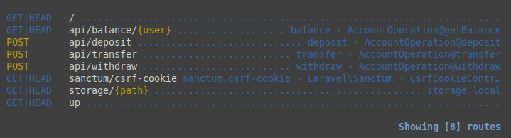
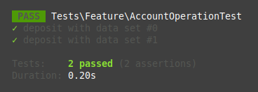

# Тестовый проект для Codemate Team (ИП Дегтярев Михаил Алексеевич)

Приложение для работы с балансом пользователей (PHP / Laravel)

Описание задачи

Нужно реализовать небольшое приложение на Laravel, которое позволяет управлять балансом пользователей:

	зачислять средства
	списывать средства
	переводить деньги между пользователями
	получать текущий баланс

Все данные должны храниться в базе данных PostgreSQL.
Взаимодействие с приложением должно происходить через HTTP API (JSON-запросы и ответы).

Основной функционал

* Начисление средств пользователю

	POST /api/deposit
	{
	  "user_id": 1,
	  "amount": 500.00,
	  "comment": "Пополнение через карту"
	}
* Списание средств

	POST /api/withdraw
	{
	  "user_id": 1,
	  "amount": 200.00,
	  "comment": "Покупка подписки"
	}

	Баланс не может уходить в минус.

* Перевод между пользователями

	POST /api/transfer
	{
	  "from_user_id": 1,
	  "to_user_id": 2,
	  "amount": 150.00,
	  "comment": "Перевод другу"
	}

* Получение баланса пользователя

	GET /api/balance/{user_id}
	{
	  "user_id": 1,
	  "balance": 350.00
	}

Требования

    • Проект должен быть выполнен на PHP 8+.
    • Хранение данных — в PostgreSQL.
    • Выложить проект на гитхаб с Readme
    • Приложение должно быть развернуто в докере
    • Все денежные операции должны выполняться в транзакциях.
    • Баланс не может быть отрицательным.
    • Если у пользователя нет записи о балансе — она создаётся при первом пополнении.
    • Все ответы и ошибки должны быть в формате JSON, с корректными HTTP-кодами.
        ◦ 200 — успешный ответ
        ◦ 400 / 422 — ошибки валидации
        ◦ 404 — пользователь не найден
        ◦ 409 — конфликт (например, недостаточно средств)
    • Транзакция имеет следующие статусы: deposit, withdraw, transfer_in, transfer_out

* *Будет плюсом покрытие кода тестами*

## Установка

**Стёк:** Laravel, PostgreSQL

**Автор** Минхаеров Артур

Скачать GIT-репозиторий.

    git clone https://github.com/older777/codemate-team-test.git CodemateTeamTest

Выполнить следующие команды

    cd CodemateTeamTest

Создать новый *.env* файл (из *.env.example*)

	cp .env.example .env

Установить необходимые компоненты

    composer install

Запустить докер

    ./sail build
    ./sail up

В новом окне терминала (та же директория), установить миграции

    ./sail artisan migrate
    ./sail artisan db:seed

Проверить роуты 

	./sail artisan route:list

Список роутов

## Работа с API

Выполнить следующие запросы в тестовом проекте. Операция пополнения

	curl --location 'http://127.0.0.1/api/deposit' \
		--header 'Content-Type: application/json' \
		--data '{
			"user_id": 1,
			"amount": 500.00,
			"comment": "Пополнение через карту"
		}'

Ответ в случае успешного выполнения

	{
	    "success": true,
	    "message": "Операция выполнена"
	}

Операция вывода

	curl --location 'http://127.0.0.1/api/withdraw' \
		--header 'Content-Type: application/json' \
		--data '{
			"user_id": 1,
			"amount": 200.00,
			"comment": "Покупка подписки"
		}'

Операция перевода

	curl --location 'http://127.0.0.1/api/transfer' \
		--header 'Content-Type: application/json' \
		--data '{
			"from_user_id": 1,
			"to_user_id": 2,
			"amount": 100.0,
			"comment": "Перевод другу"
		}'

После выполнения команд, получить успешные ответы.

Проверить баланc пользователей

	curl --location 'http://127.0.0.1/api/balance/1'

>Результат {"success":true,"user_id":1,"balance":200}

	curl --location 'http://127.0.0.1/api/balance/2'

>Результат {"success":true,"user_id":2,"balance":100}

## Ошибочные операции

Операции с кодами; 422, 404, 409

Выполнить запрос баланса для не существующего пользователя

	http://127.0.0.1/api/balance/111

Получить ошибку

	{
		"success": false,
		"message": "Страница не найдена. Либо неверный адрес"
	}

Выполнить вывод средств и получить ошибку о недостатке средств

	curl --location 'http://127.0.0.1/api/withdraw' \
		--header 'Content-Type: application/json' \
		--data '{
			"user_id": 1,
			"amount": 100000.00,
			"comment": "Вывод на карту"
		}'

Выполнить операцию перевода не существующему пользователю

	curl --location 'http://127.0.0.1/api/transfer' \
		--header 'Content-Type: application/json' \
		--data '{
			"from_user_id": 1,
			"to_user_id": 111,
			"amount": 150.0,
			"comment": "Перевод другу"
		}'

## Тестирвоание PHPunit

Для тестирования необходимо создать тестовый env командой

	cp .env.example .env.testing

Запустить тесты

	./sail test
	или
	./sail artisan test

В проекте доступен один интеграционный тест *AccountOperationTest*, в котором есть тест *test_deposit* для тестирование роута *deposit*. ДатаПровайдер предоставляет 2 пакета входных данных. Будет проиведено сравнение результатов на верный и ошибочный запрос. Результат теста:

